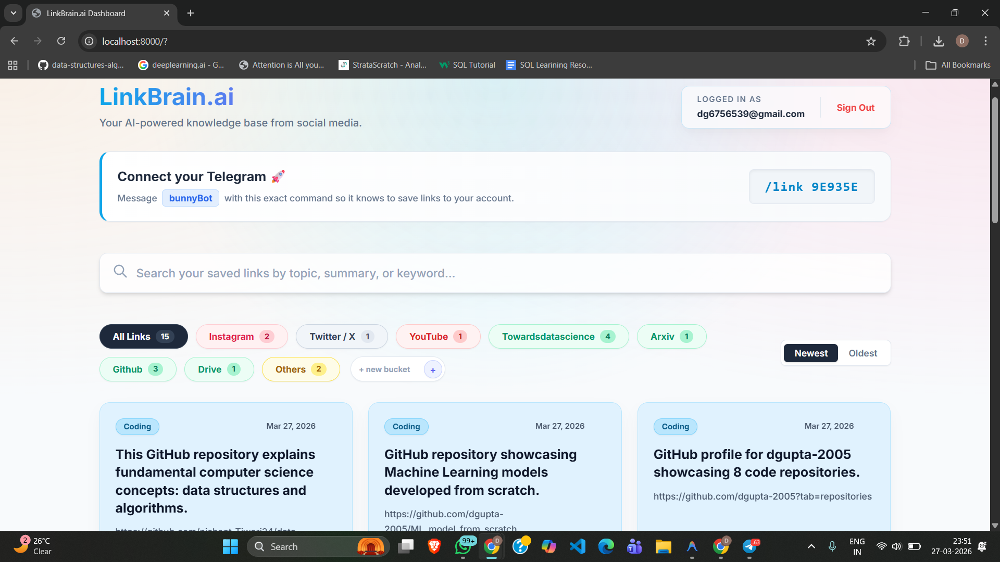
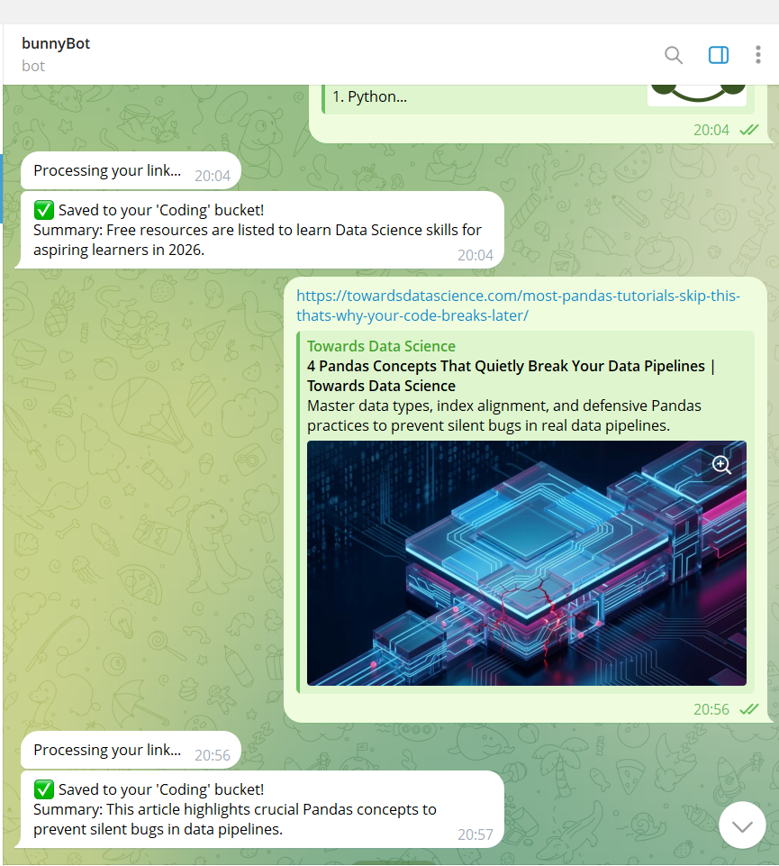
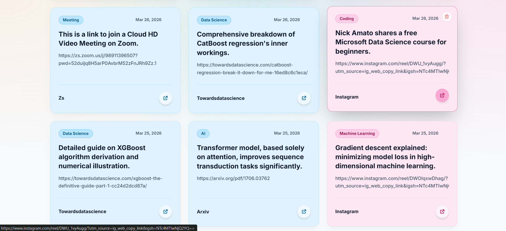

# LinkBrain.ai

**LinkBrain.ai** is a premium, AI-powered knowledge management platform designed to transform your cluttered social media links into an organized, searchable, and summarized wisdom base. 

Capture interesting content from Instagram, Twitter/X, YouTube, and the wider web via a simple Telegram message, and let AI do the heavy lifting of summarization and categorization.

---
[Problem Statement Document of this project](https://drive.google.com/file/d/1O55vG4aR6W3tumOt0jKhPtLfPR8o-tNx/view)

[Message bunnyBot here](https://t.me/bunny05_bot)

## 🚀 Features

- **Instant Capture**: Save any link by simply messaging it to our integrated Telegram Bot (**bunnyBot**).
- **AI-Powered Summarization**: Uses **Google Gemini 1.5 Flash (and 2.0/2.5 Previews)** to generate concise, 1-sentence summaries and clever category tags.
- **Smart Categorization**: Automatically detects platforms like Instagram, Twitter, and YouTube.
- **Custom Buckets**: Create your own dedicated platform containers (e.g., "LinkedIn", "Medium") dynamically from the dashboard.
- **Chronological Sorting**: Toggle between "Newest Added" and "Oldest Added" to find exactly what you need.
- **Full-Text Search**: Instantly filter through your entire link collection using keywords, summaries, or categories.
- **Premium Glassmorphic UI**: A stunning, vibrant light-mode dashboard built for clarity and visual excellence (VIBE CODED).
- **Secure Authentication**: JWT-based user accounts with encrypted link codes for Telegram pairing.

---

## 📸 Live Demo & Visuals

---

>

---

## 🛠️ Technologies Used

| Layer | Technology |
|---|---|
| **Backend** | **FastAPI** (Python 3.13+) |
| **Database** | **SQLModel** (SQLite) |
| **Frontend** | **Jinja2 Templates** & **Tailwind CSS** |
| **AI Integration** | **Google Gemini API** (Generative AI) |
| **Bot Framework** | **python-telegram-bot** |
| **Metadata** | **Microlink API** (OG Tags extraction) |
| **Security** | **PyJWT** & **Bcrypt** |

---

## 🏗️ System Architecture & AI Details

LinkBrain.ai operates on a three-tier architecture:

1. **Ingestion (Telegram Bot)**: The `bot.py` listener receives links, identifies the source platform, and pairs them with your unique `link_code`.
2. **Processing (AI Agent)**: The `ai_agent.py` pulls metadata via Microlink and passes the raw content to **Google Gemini**. The AI generates a structured JSON response containing the summary and the best-fit category.
3. **Delivery (FastAPI Dashboard)**: A secure web interface served via `main.py` that handles user sessions and displays the link collection with dynamic filtering and sorting logic.

---

## 📖 Usage

1. **Register**: Create an account on the LinkBrain.ai landing page.
2. **Link Telegram**: Copy your unique **Link Code** from the dashboard.
3. **Start Bot**: Open Telegram, find your bunnyBot, and send `/link YOUR_CODE`.
4. **Save Links**: Send any URL to the bot.
5. **Organize**: Watch as the link appears instantly on your dashboard with an AI summary. Use the **+ New Bucket** feature to create custom platform filters!
